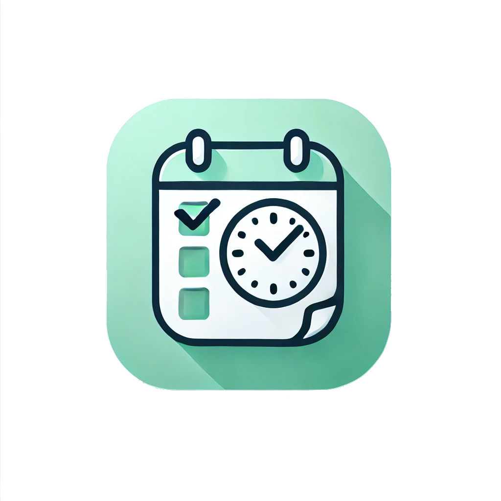
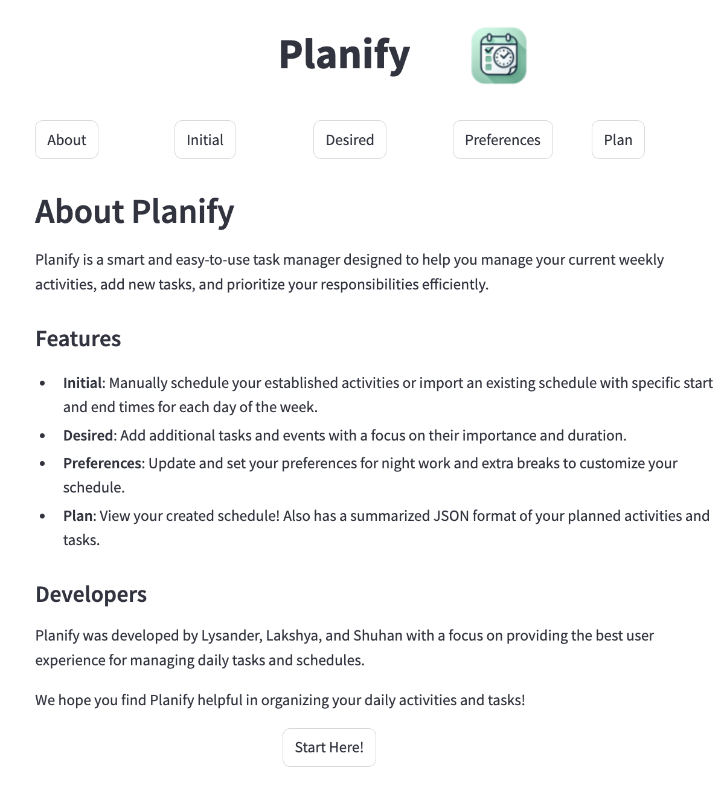
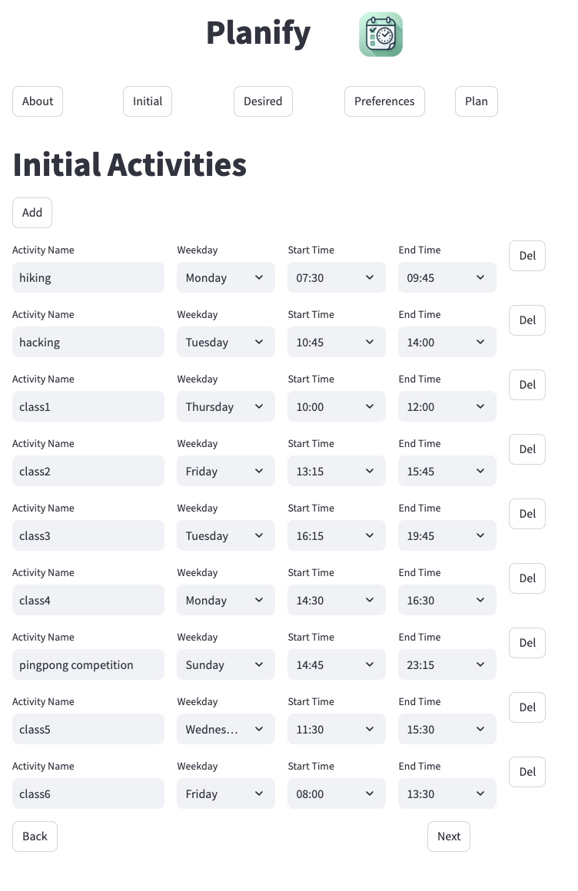
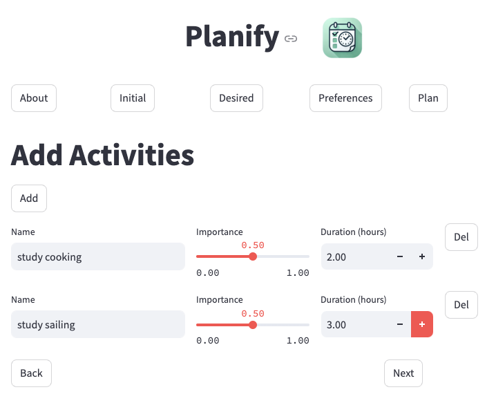
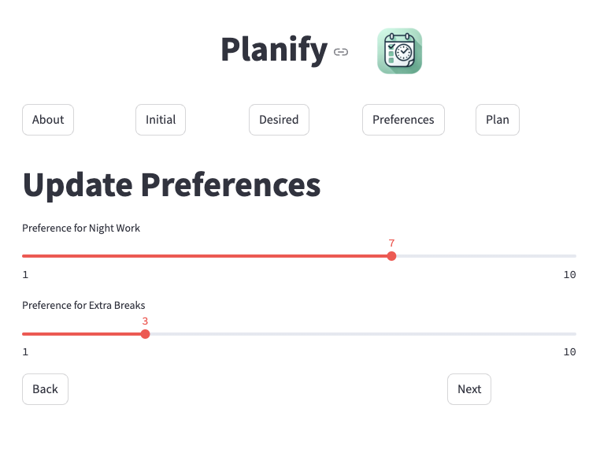
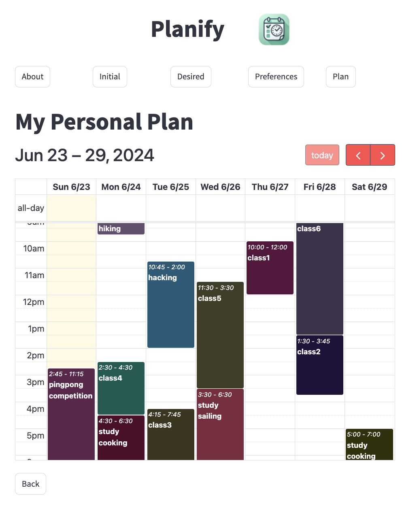

# Planify




A smart and easy-to-use task manager powered by AI.

- **Initial Scheduling**: Manually schedule your established activities or import an existing schedule with specific start and end times for each day of the week.
- **Task Addition**: Add additional tasks and events, prioritizing their importance and duration.
- **Customization**: Update and set your preferences for night work and extra breaks to customize your schedule.
- **Plan Overview**: View your created schedule and access a summarized JSON format of your planned activities and tasks.

## Prerequisites

- Python 3.6 or higher
- pip
- OpenAI configuration and API key

For more information on how to configure OpenAI, please refer to the [documentation](https://docs.openai.com/docs/quickstart).

## Configuration

1. Clone the repository:

    ```bash
    git clone git@github.com:LysanderT/planify.git
    ```
    ```bash
    cd planify
    ```

2. Create a virtual environment (optional):

    ```bash
    python -m venv planify-env
    ```

   Then activate the virtual environment:

   For Windows:

    ```bash
    planify-env\Scripts\activate
    ```

   For MacOS and Linux:

    ```bash
    source planify-env/bin/activate
    ```

3. Install the dependencies:

    ```bash
    pip install streamlit
    pip install streamlit_calendar
    ```

4. Choose the desired OpenAI model in `Client.py` at lines [82](Client.py#L82) and [95](Client.py#L95) by replacing the model name with the desired model name.

5. Run the application:

    ```bash
    streamlit run Home.py
    ```

6. Open your browser and navigate to the following URL to enjoy Planify:

    ```bash
    http://localhost:8501/
    ```

## Usage

After running the application, you will be greeted with the following screen:



From here, you can navigate to the following tabs to create your schedule:

- **Initial**: Manually schedule your established activities or import an existing schedule with specific start and end times for each day of the week.



- **Addons**: Add additional tasks and events, prioritizing their importance and duration.



- **Prefs**: Update and set your preferences for night work and extra breaks to customize your schedule.



- **Plan**: Generate and view your created schedule and access a summarized JSON format of your planned activities and tasks.



## Declaration

This is a demo project for the [Berkeley AI Hackathon](https://live.calhacks.io/) and is not intended for commercial use.
See our devpost [here](https://devpost.com/software/planify-jgwkht#updates) for more information.